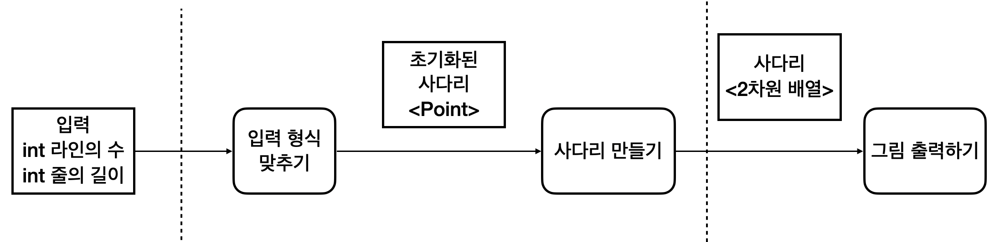

# Java Ladder

## 학습 리스트

- [ ] StringBuilder VS StringBuffer 중 어떤 것이 더 효율적인가?
- [ ] 자바에서 배열대신 List 사용해야 하는 이유
- [ ] 좋은 단위테스트가 무엇인지 공부하기
- [ ] 패키지를 어떻게 나누는지, 조사해보기
- [ ] HashCode 에 대해 공부하기
- [ ] SparkJava 에 대해 공부하기
- [ ] JVM 의 동작 원리 공부하기

# 각 단계의 학습 목적

## 사다리 게임 1 단계 - 기본 기능 구현

### 1. 객체 단위로 데이터의 흐름을 생각해본다.

1. 사용자로 부터 입력을 받는다. 
2. 입력으로 부터, 적절한 데이터 구조를 만든다. (여기서는 2차원 맵)  
3. 2 번에서 만들어진 데이터 구조를 통해, 원하는 로직을 실행한다.
4. 3 번에서 출력된 데이터 구조를 통해 사다리의 모양을 출력한다.

### 2. ArrayList이 아닌 int[][]을 사용하여 2차원의 맵을 만든다.

나는 아직 자바에서 콜렉션 프레임 중 하나인 `ArrayList` 사용하여 배열을 표현 하는지 알지 못한다.  
콜렉션 프레임워크에서 다양한 메소드를 제공하기 때문에, 데이터를 처리할 때 더 편하기 때문이라고 예상하지만, 좀 더 자세히 알아야 될 필요가 있다.

먼저 int[][] 를 사용하여, 맵을 구현해보고 ArrayList로 변경함으로써 더 편해지는 점을 생각보기 위해 int[][]를 사용한다.

## 사다리 게임 2 단계 - 리펙토링 맛보기

### 1. 2중 3중 for문을 되도록 사용하지 않는다.

코드의 효율성도 중요하지만, 코드의 가독성도 매우 중요하다고 들었다.
코드가 2중, 3중으로 되어 있다면 읽기가 매우 어려워 지니, 가독성을 높이기위해 리펙토링을 하보자.

### 2. "구현 순서를 고려하면서 프로그래밍한다." 라는 말이 무슨 의미인지 알아본다.

## 사다리 게임 3 단계 - 사다리 모양 개선

### 배열 대신 ArrayList를 사용한다.

int 배열 자료형을 사용하여 구현했다면, ArrayList로 바꿔보자.  
그리고 어떤 점이 좋아졌는지, 안좋아졌는데 생각해 본다.  

## 사다리 게임 4 단계 - 리팩토링 2

### 1. 단위테스트를 만들어 테스트를 해본다.

단위테스트를 진행하지 않고서 구현을 했다고 가정해보자.  
그리고 컴파일은 되지만 결과가 이상할 경우를 생각해본다면, 문제가 되는 부분을 찾는 것은 매우 힘겨운 일이 될것이라는 것은 쉽게 상상할 수 있다.  

단위테스트를 만들되, 어느정도의 단위가 적절한지 공부해 본다.

### 2. 패키지를 분리한다.

각각의 역할에 맞도록 패키지를 분리한다.  
여기서 역할이 뭔지, 어떻게 나누면 좋을지에 대해 공부해본다.

## 사다리 게임 5 단계 - 실행결과 출력

## 사다리 게임 6 단계 - GUI 구현하기

### Swing이나 AWT를 사용해서 구현한다.

지금까지 툴을 사용하여 GUI를 구현해본적은 없었다.  
이번에 자바에서 지원하는 GUI 툴은 무엇들이 있고, 어떻게 사용하면 좋을지에대해 공부한다.
